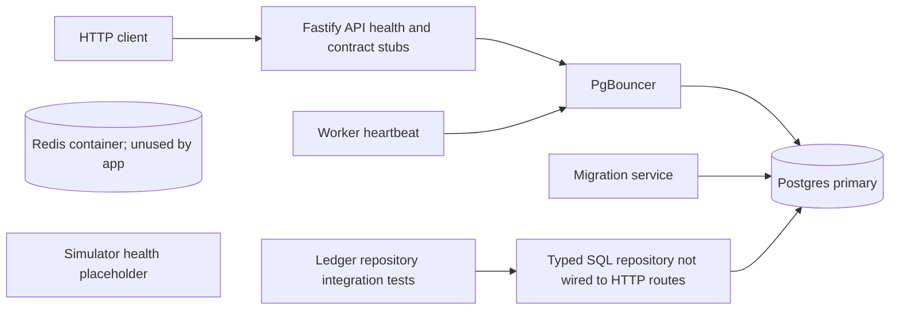
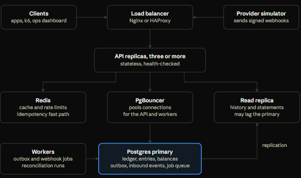
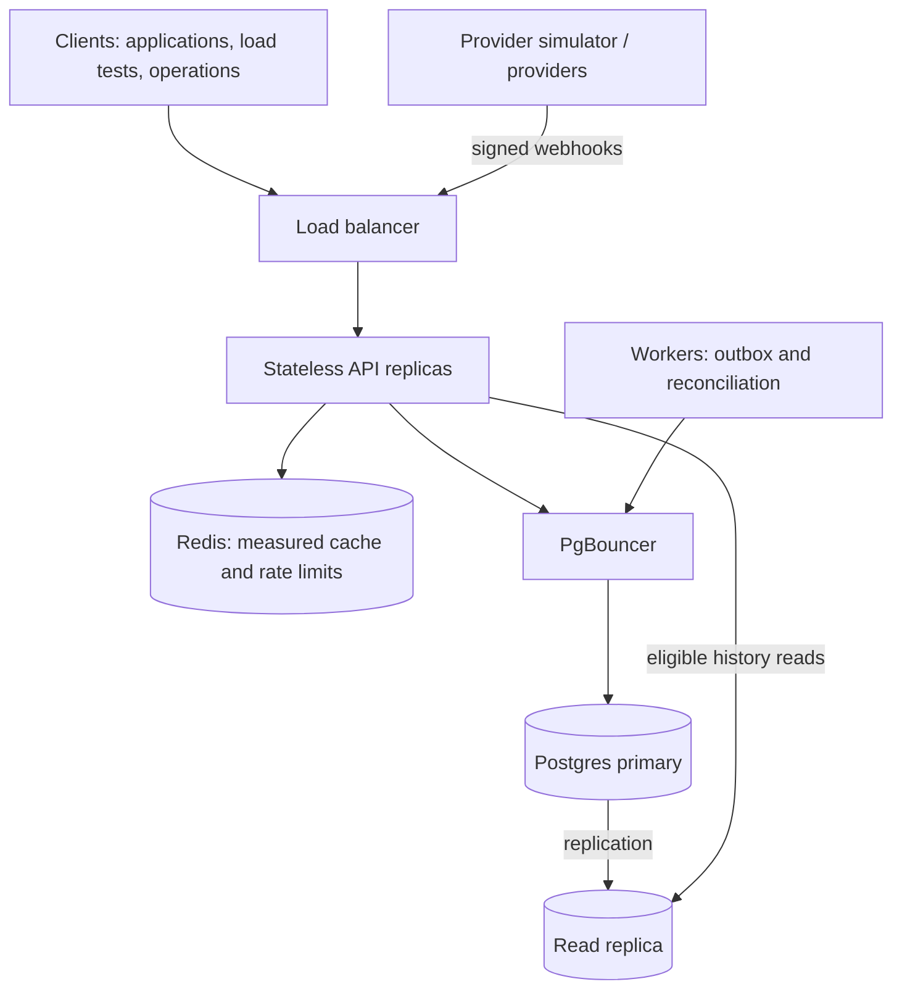
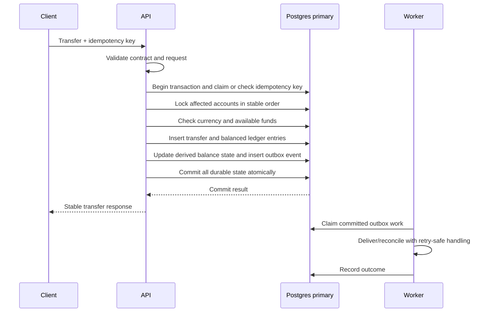
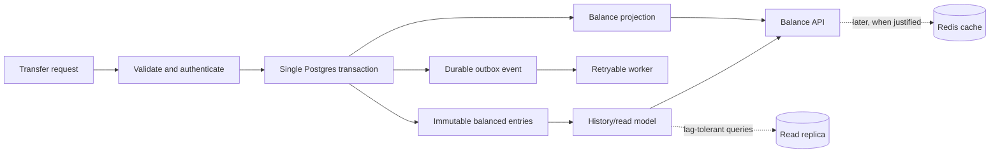

# OpenLedger Architecture

This guide separates the current implementation from the proposed target architecture. The target diagram is aspirational: replicas, caching, provider webhooks, and horizontal API scaling are not yet implemented or load-tested.

## Current: Phase 1 Ledger Core



The current stack has one API process, one worker process, one Postgres primary, and PgBouncer. The worker only checks database connectivity. Account and transfer HTTP routes remain contract-validation stubs and return `501`; the typed ledger repository is exercised directly by Postgres integration tests and is not yet wired to those routes. The simulator exposes a health endpoint but does not generate provider traffic or call the API. Redis starts in Compose but application code does not use it. Migrations connect directly to Postgres; API and worker database traffic goes through PgBouncer.

Compose services do not necessarily represent implemented application features. Current endpoints and limitations are documented in the [Phase 0 guide](roadmap/phase-0.md).

## Target: Scaled Deployment



_Supplied target topology. API replicas, load balancer, cache, read replica, signed provider webhooks, outbox jobs, and reconciliation workers are future components._



The target separates request handling, durable writes, asynchronous work, and read scaling:

- **API replicas** are stateless so capacity can grow behind a load balancer. They must not own authoritative balances in process memory.
- **Postgres primary** remains the authority for ledger entries, idempotency, balance state, and durable job records. Every money-moving operation must commit atomically here.
- **PgBouncer** limits and reuses database connections from API and worker processes. Migrations continue to connect directly to Postgres.
- **Read replicas** can serve read models that tolerate replication lag. They must not decide whether funds are available or whether a transfer may be posted.
- **Redis** is only justified for data such as cache entries and rate limits where measured latency or throughput warrants another dependency. It is not the source of truth for balances or idempotency.
- **Workers** process durable outbox work and reconciliation. Provider calls happen outside the database transaction; their outcomes are recorded durably and retried safely.
- **Provider callbacks** must be authenticated (for example, verified signatures), deduplicated, and persisted before asynchronous business processing.

The target is not a mandate to deploy every box at once. Add replicas, caching, and additional API processes only with measurements and an operational plan for their failure modes.

## Candidate Transfer Write Path

This sequence sketches a correctness boundary for the next implementation phase. It is a design direction, not an existing endpoint implementation.



The central invariant is that the transfer, its debit and credit entries, any derived balance update, the idempotency result, and the outbox event cannot be partially committed. For every posted transaction, the sum of its entries is zero. Concurrent debits must be serialized or otherwise constrained so the same available funds cannot be spent twice. Implementation ADRs and Postgres integration and concurrency tests must establish the locking strategy, schema constraints, retry behavior, and balance representation.

## Read and Write Boundaries



The dotted paths are optional future optimizations. The primary transaction is the only authority for accepting a transfer; cache and replica data may be stale and must not authorize spending.

## Local PostgreSQL for Phase 1 Development

Local PostgreSQL can be used for development and database-backed tests. Docker Compose remains available for reproducible startup and CI. Only one local service should bind PostgreSQL's default port at a time.

### Linux

On Debian or Ubuntu, PostgreSQL can be managed with the distribution's cluster tools. Start the local cluster and verify readiness:

```bash
sudo pg_ctlcluster 16 main start
pg_isready -h localhost -p 5432
```

Create the development role and database once, if they do not already exist. The role command prompts for a password. Use a development-only password and keep it out of source control.

```bash
sudo -u postgres createuser --pwprompt openledger
sudo -u postgres createdb --owner=openledger openledger
```

### Windows PowerShell

For a native Windows PostgreSQL installation, check the service and start the installed PostgreSQL service from an elevated PowerShell session if needed:

```powershell
Get-Service -Name 'postgresql*'
Start-Service -Name 'postgresql-x64-16'
pg_isready -h localhost -p 5432
```

The service name can vary by installed PostgreSQL version. Once PostgreSQL is running, create the application role and database using the `postgres` administrator account. `createuser` prompts for a development password:

```powershell
createuser -h localhost -U postgres --pwprompt openledger
createdb -h localhost -U postgres --owner=openledger openledger
```

### Run migrations and database tests

From the repository root, set `DATABASE_URL` in the shell used for the migration and integration commands. Replace the placeholder with the local development password; do not commit it.

```powershell
$env:DATABASE_URL = 'postgres://openledger:<development-password>@localhost:5432/openledger'
npm run migrate
npm run test:integration
Remove-Item Env:DATABASE_URL
```

For a Bash shell:

```bash
export DATABASE_URL='postgres://openledger:<development-password>@localhost:5432/openledger'
npm run migrate
npm run test:integration
unset DATABASE_URL
```

The placeholder password must be replaced before running the commands. If Compose PostgreSQL is already using the default port, stop that service before starting a separate local server. This is local development guidance, not a production deployment plan.

## Design Questions to Resolve Before Scale-Out

- Which balance representation is authoritative, and how is it reconciled against the immutable journal?
- Which transactions require synchronous primary reads, and which read models can tolerate replica lag?
- What idempotency scope, retention period, and behavior apply when a key is reused with a different request body?
- How are outbox leases, retries, poison messages, and provider timeouts observed and recovered?
- Which workload measurements justify Redis, replicas, more API processes, or PgBouncer pool changes?
- How are database backups, point-in-time recovery, failover, and reconciliation tested operationally?
