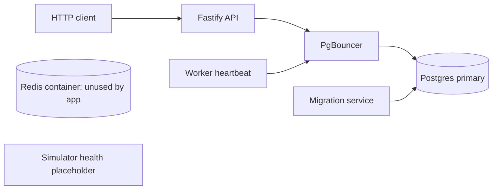
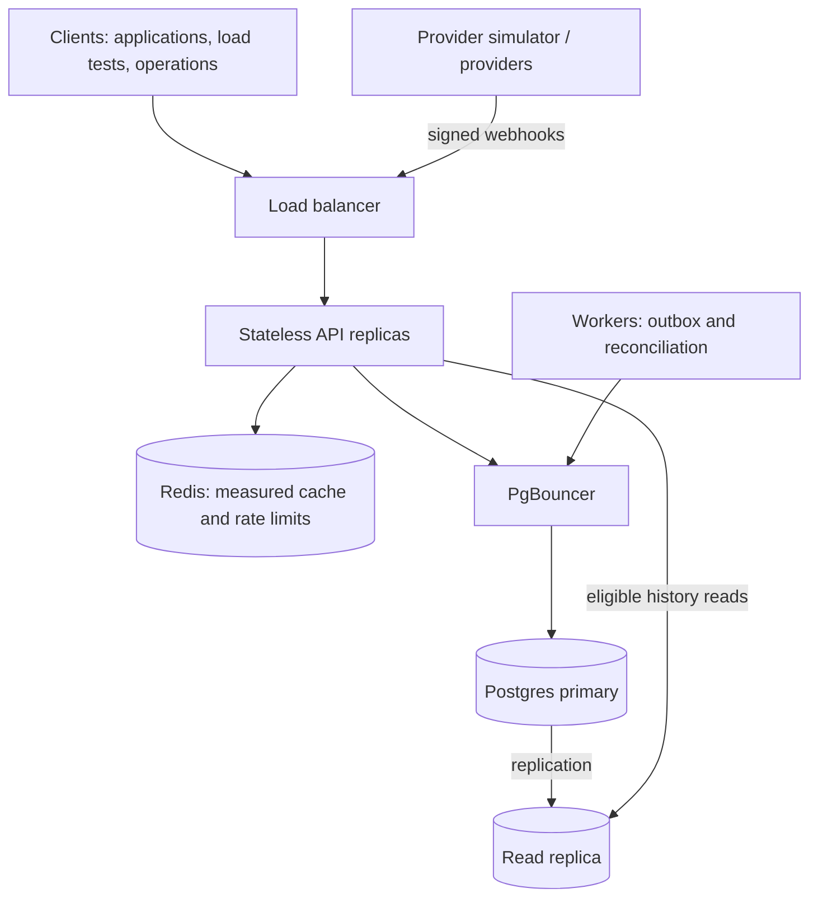
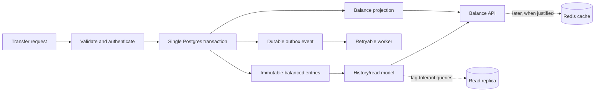

# OpenLedger Architecture

This guide uses diagrams to separate what runs today from what the project is designed to grow into. The target diagram is intentionally aspirational: it is not evidence that replicas, caching, provider webhooks, or horizontal API scaling have already been built or load-tested.

## Current: Phase 0



The Phase 0 application has one API process, one worker process, one Postgres primary, and PgBouncer. The worker only checks database connectivity. The simulator exposes a health endpoint but does not generate provider traffic or call the API. Redis starts in Compose but application code does not use it. Migrations connect directly to Postgres; API and worker database traffic goes through PgBouncer.

These distinctions matter: a service appearing in Compose is not the same as a production feature being implemented. Current endpoints and limitations are documented in the [Phase 0 guide](roadmap/phase-0.md).

## Target: Scaled Deployment


_Supplied target topology. API replicas, load balancer, cache, read replica, signed provider webhooks, outbox jobs, and reconciliation workers are future components._



The target separates request handling, durable writes, asynchronous work, and read scaling:

- **API replicas** are stateless so capacity can grow behind a load balancer. They must not own authoritative balances in process memory.
- **Postgres primary** remains the authority for ledger entries, idempotency, balance state, and durable job records. Every money-moving operation must commit atomically here.
- **PgBouncer** limits and reuses database connections from API and worker processes. Migrations continue to connect directly to Postgres.
- **Read replicas** can serve read models that tolerate replication lag. They must not decide whether funds are available or whether a transfer may be posted.
- **Redis** is only justified for data such as cache entries and rate limits where measured latency or throughput warrants another dependency. It is not the source of truth for balances or idempotency.
- **Workers** process durable outbox work and reconciliation. Provider calls happen outside the database transaction; their outcomes are recorded durably and retried safely.
- **Provider callbacks** must be authenticated (for example, verified signatures), deduplicated, and persisted before asynchronous business processing.

The target is not a mandate to deploy every box at once. Add replicas, caching, and additional API processes only with measurements and an operational plan for their failure modes.

## Candidate Transfer Write Path

This sequence sketches the correctness boundary to design and test in the next implementation phase. It is a design direction, not an existing endpoint implementation.

```mermaid
sequenceDiagram
    participant C as Client
    participant A as API
    participant P as Postgres primary
    participant W as Worker
    C->>A: Transfer + idempotency key
    A->>A: Validate contract and request
    A->>P: Begin transaction; claim/check idempotency key
    A->>P: Lock affected accounts in stable order
    A->>P: Check currency and available funds
    A->>P: Insert transfer and balanced ledger entries
    A->>P: Update derived balance state and insert outbox event
    A->>P: Commit all durable state together
    P-->>A: Commit result
    A-->>C: Stable transfer response
    W->>P: Claim committed outbox work
    W->>W: Deliver/reconcile with retry-safe handling
    W->>P: Record outcome
```

The central invariant is that the transfer, its debit and credit entries, any derived balance update, the idempotency result, and the outbox event cannot be partially committed. For every posted transaction, the sum of its entries is zero. Concurrent debits must be serialized or otherwise constrained so the same available funds cannot be spent twice. Exact locking, schema constraints, retry handling, and balance representation must be settled in implementation ADRs and proven with Postgres integration and concurrency tests.

## Read and Write Boundaries



The dotted paths are optional future optimizations. The primary transaction is the only authority for accepting a transfer; cache and replica data may be stale and must not authorize spending.

## WSL PostgreSQL for Phase 1 Development

The next implementation phase will use the Ubuntu WSL PostgreSQL instance for local development and database-backed tests. The current workstation has Ubuntu 24.04 with PostgreSQL 16.15; cluster `16/main` is online on port `5432`, and Windows can reach it through `127.0.0.1:5432`. This has been checked with:

```powershell
wsl.exe -d Ubuntu -- psql --version
wsl.exe -d Ubuntu -- pg_lsclusters
wsl.exe -d Ubuntu -- pg_isready -h 127.0.0.1 -p 5432
Test-NetConnection -ComputerName 127.0.0.1 -Port 5432 -InformationLevel Quiet
```

If the cluster is stopped after a WSL restart, start it inside Ubuntu:

```bash
sudo pg_ctlcluster 16 main start
pg_isready -h 127.0.0.1 -p 5432
```

Create the development role and database once, only if they do not already exist. The role command prompts for a local password; use a development-only value and do not commit it.

```bash
sudo -u postgres createuser --pwprompt openledger
sudo -u postgres createdb --owner=openledger openledger
```

Then run the API and migration commands from the Windows repository checkout with `DATABASE_URL` set to the WSL-forwarded localhost endpoint:

```powershell
$env:DATABASE_URL = 'postgres://openledger:<local-password>@127.0.0.1:5432/openledger'
npm run migrate
npm run test:integration
```

Do not run the example command with the placeholder password unchanged. For the WSL-backed workflow, stop the Compose Postgres service first so port `5432` is not contested. Phase 0's documented one-command Compose workflow remains available and unchanged; the WSL path is the planned Phase 1 development database, not a production deployment plan.

## Design Questions to Resolve Before Scale-Out

- Which balance representation is authoritative, and how is it reconciled against the immutable journal?
- Which transactions require synchronous primary reads, and which read models can tolerate replica lag?
- What idempotency scope, retention period, and behavior apply when a key is reused with a different request body?
- How are outbox leases, retries, poison messages, and provider timeouts observed and recovered?
- Which workload measurements justify Redis, replicas, more API processes, or PgBouncer pool changes?
- How are database backups, point-in-time recovery, failover, and reconciliation tested operationally?
