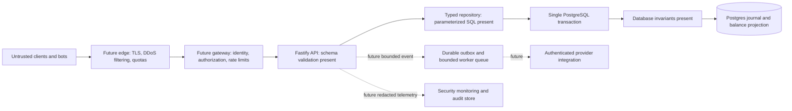
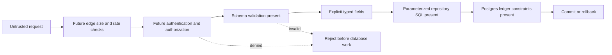
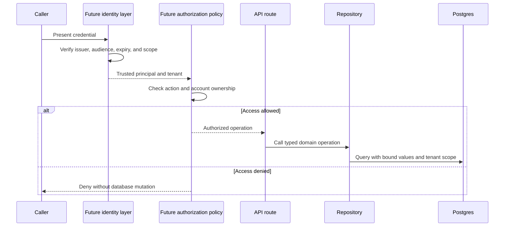
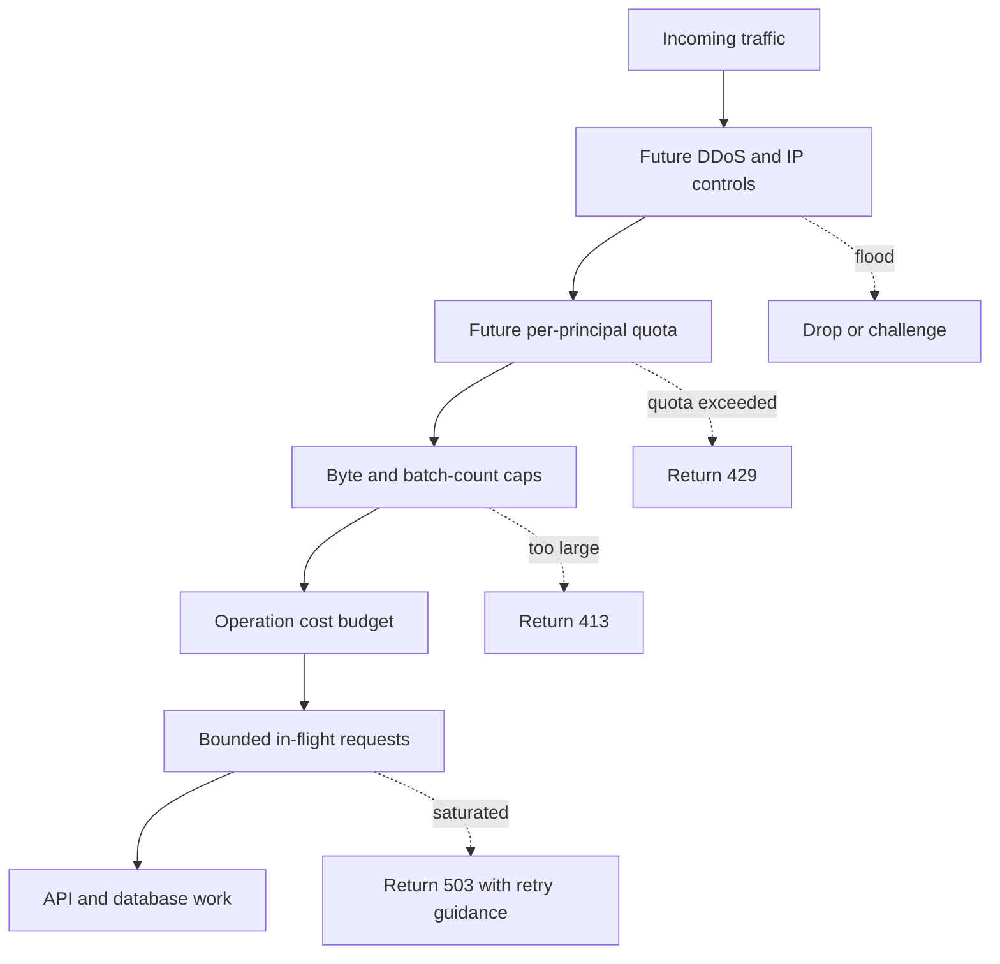
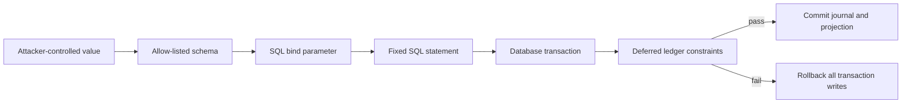
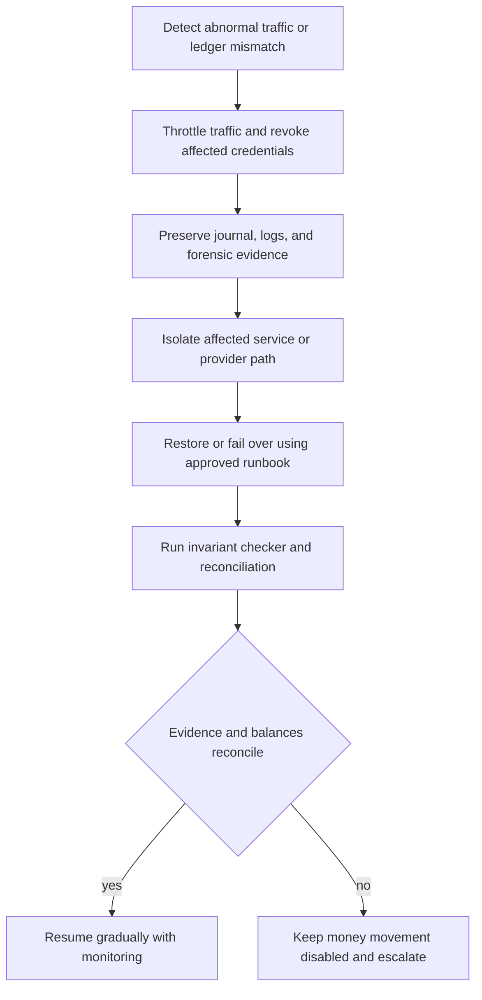
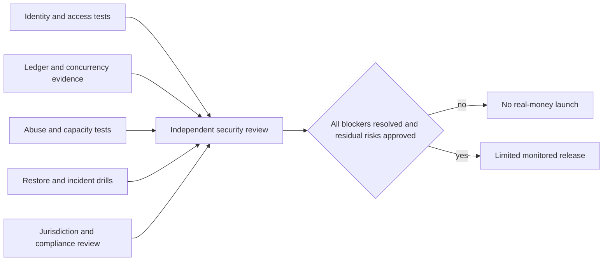

# Security and Financial Safety

## Security Position

OpenLedger is an engineering project, not a production payment service or a security certification. The Phase 1 database core has meaningful integrity controls, but the current HTTP routes are unauthenticated `501` stubs and the local Compose configuration uses development credentials and publishes service ports. **No real funds, credentials, or customer data may be used.** The current state is not ready for public internet exposure, production, or a claim of Facebook- or Paystack-scale capacity.

Security work is tracked as implementation plus evidence, not as a checklist that can guarantee zero risk. Before handling real money, the project requires independent application-security review, penetration testing, operational recovery exercises, legal/compliance review for the intended jurisdictions, and documented approval of residual risk.

## Current Controls and Gaps

| Area                         | Present evidence                                                                                                                                                                                                                     | Required before production                                                                                                                                                                   |
| ---------------------------- | ------------------------------------------------------------------------------------------------------------------------------------------------------------------------------------------------------------------------------------ | -------------------------------------------------------------------------------------------------------------------------------------------------------------------------------------------- |
| Request validation           | OpenAPI-derived JSON Schema validates route inputs; coercion is disabled. Integration tests cover invalid identifiers, missing headers, and fractional minor units.                                                                  | Set explicit request/body/array limits; fuzz schemas and parsers; ensure every future route has validation and consistent error mapping.                                                     |
| SQL injection                | Ledger repository uses PostgreSQL bind parameters for values and fixed SQL statements.                                                                                                                                               | Keep dynamic identifiers out of interpolated SQL; add static analysis and adversarial injection tests to every query surface.                                                                |
| Ledger correctness           | Database constraints and triggers enforce positive entries, one transaction currency, forward-only status, append-only entries/history, balanced postings at commit, nonnegative customer balances, and balance-to-journal equality. | Production database roles must prevent application callers from bypassing trigger paths; independent review of migrations and concurrency model; backup/restore and reconciliation evidence. |
| Idempotency                  | Unique database key, canonical request hash, conflict handling, and integration coverage exist in the repository module.                                                                                                             | Wire repository to authenticated routes; define key scope/retention and client response semantics; load-test contention and concurrent duplicates.                                           |
| Authentication/authorization | Not implemented. Current account and transfer routes are stubs and have no identity checks.                                                                                                                                          | Strong client authentication, role/scope authorization, object-level ownership checks, privileged-operation controls, key rotation, and negative authorization tests.                        |
| Rate and resource limits     | Fastify provides request parsing and a default body limit; no application rate limiter or admission policy is configured.                                                                                                            | Enforce edge and application quotas, bounded batch sizes, per-identity concurrency, request deadlines, database statement timeouts, queue limits, and backpressure.                          |
| Secrets                      | `.env` and `.env.*` are ignored except `.env.example`; environment values are validated at startup.                                                                                                                                  | Replace Compose defaults, use a managed secret store, rotate credentials, restrict secret readers, scan history and CI artifacts, and use separate runtime/migration identities.             |
| Transport/network            | Compose is a local development topology.                                                                                                                                                                                             | TLS at every external boundary, private database networks, firewall policy, no public database ports, and verified production proxy configuration.                                           |
| Logging                      | Structured Pino logging and request IDs exist; errors are returned as generic `500` responses.                                                                                                                                       | Redact credentials, tokens, payment data, and personal data; prevent untrusted request IDs from forging log correlation; centralize tamper-resistant audit events and alerting.              |
| CI/dependencies              | GitHub Actions runs formatting, lint, typecheck, unit tests, migrations, and Postgres integration tests.                                                                                                                             | Pin actions by immutable commit, automate dependency and secret scanning, generate an SBOM, protect releases, scan images, and review migration changes.                                     |
| Availability                 | Compose health checks and PgBouncer readiness gates exist.                                                                                                                                                                           | Multi-zone topology, tested failover, DDoS plan, load-tested capacity, circuit breakers, queue recovery, backups, point-in-time restore, and incident runbooks.                              |
| Provider callbacks           | No production webhook ingestion exists.                                                                                                                                                                                              | Verify signatures using raw request bytes, enforce timestamp/replay windows, deduplicate durably, and queue bounded asynchronous work.                                                       |

The development Compose file deliberately makes local services easy to inspect. Its credentials, exposed ports, and single-primary setup are not a deployment template. Do not reuse them outside a local isolated environment.

## 1. Request Defense Flow

The diagram distinguishes current protections from controls required before internet exposure.

The current route handlers do not yet pass through identity, authorization, application rate limits, or a durable queue. The diagram is a control plan, not a claim that these future components are deployed.

## Financial Safety Rules

- The journal is authoritative; a cached, replicated, or client-supplied balance must never authorize spending.
- Every posted transaction must balance to zero within one currency and commit atomically with its balance projection and idempotency result.
- A retry with the same idempotency key and same canonical request returns the original result; reusing the key with a different request is a conflict.
- Account ownership and permissions must be checked on every object access. Unpredictable UUIDs are not authorization.
- External provider calls must not occur while holding database locks. Durable outbox records and retry-safe workers are required before asynchronous side effects.
- Reversals are new journal transactions; posted entries are not edited or deleted.
- Any invariant failure, database ambiguity, or timeout must fail closed: no success response or external side effect until commit outcome is known.

## Large-Request and Flood Handling

“Millions sent in one request” must be rejected before it becomes millions of allocations, SQL parameters, locks, or queued jobs. Future endpoints must define a small, explicit maximum request size and batch item count; validate before opening a transaction; charge quotas by authenticated principal and operation cost; bound concurrent requests and worker queues; enforce request and SQL deadlines; and return `413`, `429`, or `503` without partial writes when limits are reached. Edge filtering is necessary for volumetric attacks because application code cannot absorb unbounded traffic by itself.

Limits must be chosen from load tests and operational capacity, not guessed from a marketing-scale target. At saturation, the service should shed work predictably while preserving already committed ledger state.

## Security Release Gate

Real-money handling remains blocked until all of the following have evidence:

1. Authentication, authorization, tenant/object isolation, operator access controls, and secret rotation are implemented and tested.
2. Runtime, migration, worker, and read-only database roles have least privilege; production connectivity is private and encrypted.
3. Request, batch, rate, concurrency, queue, log, and database resource limits are implemented and tested under hostile load.
4. Threat-model items in [the register](threat-model.md) have owners, mitigations, verification evidence, and explicit accepted residual risk.
5. Independent penetration testing, dependency/image review, and remediation of critical/high findings are complete.
6. Ledger property/concurrency tests, failure injection, idempotency tests, backup restoration, failover, and reconciliation drills pass.
7. Applicable legal, privacy, payments, and financial obligations are reviewed by qualified professionals for the intended jurisdictions and product.

Passing repository tests is necessary but is not proof of legal compliance, security certification, or production readiness.

## Security Diagram Series

These diagrams show distinct checkpoints, not deployed products. Existing controls are labeled; future controls remain explicitly marked as required.

### 2. Input to Database

### 3. Identity and Object Access

_Identity and authorization are not implemented; current money routes are nonfunctional stubs._

### 4. Large-Request and Flood Control

_The current API has no application rate limiter or admission policy. Limits must be measured and set before internet exposure._

### 5. Injection and Ledger Containment

_Parameterized queries and database invariants exist in the ledger repository. This does not replace authentication, query review, fuzzing, or least-privilege database roles._

### 6. Incident Containment and Recovery

_Alerting, credential revocation workflows, backup restoration, failover, and reconciliation operations are required work; this diagram is the response design, not an available runbook._

### 7. Production Release Gate

_A green CI run alone does not satisfy this gate._
