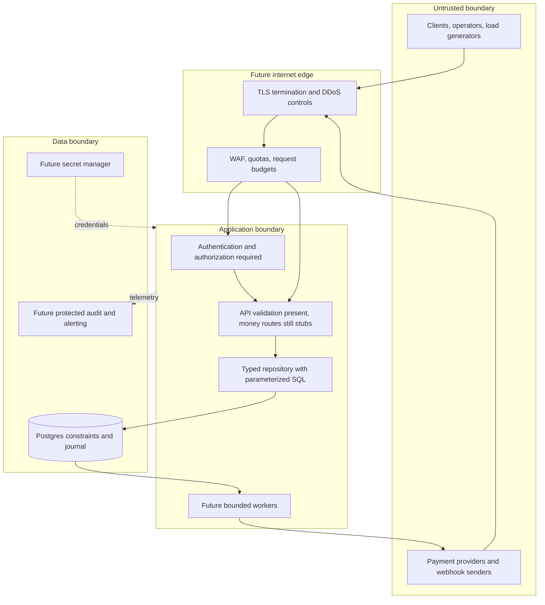

# OpenLedger Threat Model

## Scope and Method

This is a living defensive threat register for the current ledger core and planned payment paths. It records more than 50 concrete failure and abuse scenarios, the control expected to address each, and the implementation state. It is not an attacker playbook, exhaustive assurance, or proof that the controls work. Update it as endpoints, providers, infrastructure, and deployment boundaries change.

### Status legend

- **Present:** a code or database control exists now; it still needs continuing tests and review.
- **Partial:** a foundation exists but does not close the risk end to end.
- **Required:** not implemented; must be designed, built, and evidenced before the affected capability is exposed.
- **Deferred:** the feature is intentionally absent; it must remain unavailable until the corresponding controls exist.

## Trust Boundaries

The current local stack does not contain the future edge, identity, secret manager, webhook, or audit services in this diagram. The PostgreSQL checks protect ledger invariants, not user identity or network availability.

## Threat Register

### Input and query handling

| ID  | Scenario                                                      | Required defense and evidence                                                                | Status                                                                             |
| --- | ------------------------------------------------------------- | -------------------------------------------------------------------------------------------- | ---------------------------------------------------------------------------------- |
| T01 | SQL injection through transfer fields                         | Bind all values; prohibit user-controlled SQL fragments; injection tests and query review.   | Partial: repository uses parameters; routes are stubs.                             |
| T02 | SQL injection through sort, filter, or column names           | Map input to fixed allow-listed identifiers; never bind identifiers by string interpolation. | Required: no history query API yet.                                                |
| T03 | Mass assignment changes account status or type                | Explicit request DTO allow-lists; database protects immutable classification.                | Partial: DB protection exists; account route is stub.                              |
| T04 | Malformed UUID or enum bypasses route assumptions             | Schema validation and direct repository validation; malformed-input tests.                   | Partial: current route schemas validate; full API contract wiring is pending.      |
| T05 | Oversized JSON body consumes memory                           | Small explicit body limit at proxy and API; reject before parsing/allocating.                | Partial: framework default exists; production limit policy absent.                 |
| T06 | Millions of entries in one batch                              | Hard item-count and byte limits, cost quotas, pre-transaction validation.                    | Required: no batch API exists.                                                     |
| T07 | Deeply nested JSON causes parser CPU/memory pressure          | Depth/complexity bounds, request deadline, parser fuzzing.                                   | Required.                                                                          |
| T08 | Oversized headers or many headers exhaust resources           | Proxy and server header limits; load and malformed-header tests.                             | Partial: framework defaults only.                                                  |
| T09 | Conflicting duplicate headers confuse idempotency/auth        | Reject ambiguous security-sensitive headers at the edge and API.                             | Required.                                                                          |
| T10 | Content-type or encoding ambiguity bypasses validation        | Strict accepted media types, bounded decompression, parser tests.                            | Required.                                                                          |
| T11 | Values exceed BIGINT or JavaScript safe integer range         | Parse decimal strings to bigint; reject overflow before SQL; boundary tests.                 | Partial: repository uses bigint; public DTO rules and range tests pending.         |
| T12 | Unicode normalization creates confusing keys or account names | Canonicalize or restrict key alphabet; compare canonical request hashes.                     | Partial: request hash canonicalizes entry order; key normalization policy pending. |

### Identity and authorization

| ID  | Scenario                                            | Required defense and evidence                                                       | Status                                                        |
| --- | --------------------------------------------------- | ----------------------------------------------------------------------------------- | ------------------------------------------------------------- |
| T13 | Anonymous caller creates or moves funds             | Strong service/user authentication before any money route.                          | Required: routes currently return 501 without auth.           |
| T14 | Stolen or forged access token                       | Secure signature/issuer/audience/expiry validation; rotation and revocation tests.  | Required.                                                     |
| T15 | One customer reads another customer's account       | Object-level owner/tenant authorization on every read and write.                    | Required.                                                     |
| T16 | Tenant identifier can be changed in a request       | Derive tenant from verified identity; enforce tenant scoping in repository queries. | Required.                                                     |
| T17 | Customer escalates to operator/system role          | Server-controlled role assignment, least privilege, authorization tests.            | Required.                                                     |
| T18 | Operator account takeover                           | MFA, short sessions, hardware-backed recovery, privileged-action approval.          | Required.                                                     |
| T19 | Internal service credential reused across workloads | Separate API, worker, migration, and read-only identities with narrow grants.       | Required: Compose currently shares a development DB identity. |
| T20 | UUID guessing treated as access control             | Require authorization independently of identifier entropy.                          | Required with API identity layer.                             |
| T21 | Session fixation, CSRF, or browser token theft      | Appropriate SameSite/CSRF policy, secure cookies, CSP, and browser threat tests.    | Deferred: no authenticated browser workflow.                  |
| T22 | Password reset or account recovery hijacked         | Verified recovery channels, step-up checks, alerting, and abuse throttles.          | Deferred: identity system absent.                             |
| T23 | API key leaked or given excessive scope             | Hash stored keys, show once, scope, expire, revoke, and audit usage.                | Required if API keys are selected.                            |
| T24 | Cross-origin browser abuse                          | Explicit allow-listed CORS and CSRF controls; never wildcard credentialed origins.  | Required before browser auth.                                 |

### Ledger and financial integrity

| ID  | Scenario                                                     | Required defense and evidence                                                                   | Status                                                                           |
| --- | ------------------------------------------------------------ | ----------------------------------------------------------------------------------------------- | -------------------------------------------------------------------------------- |
| T25 | Same request retried after timeout creates a second transfer | Unique idempotency key and persisted original result; retry integration test.                   | Partial: repository core exists; HTTP wiring pending.                            |
| T26 | Same key reused with different amount/account                | Persist canonical request hash; return conflict; altered-body test.                             | Present in repository and tests.                                                 |
| T27 | Concurrent duplicate key races                               | Unique DB constraint and transaction retry semantics; concurrent duplicate test.                | Partial: DB uniqueness exists; concurrency case pending.                         |
| T28 | Concurrent debits spend the same funds twice                 | Stable account row locks, database overdraft invariant, contention test.                        | Present in repository/database; 500-request test passes.                         |
| T29 | Debit and credit lines do not balance                        | Deferred commit constraint and negative tests.                                                  | Present in database and tests.                                                   |
| T30 | Balance projection is modified without journal entries       | Deferred projection-versus-journal constraint and tampering test.                               | Present in database and tests.                                                   |
| T31 | Posted entry is updated or deleted                           | Append-only triggers/privileges; mutation tests.                                                | Present in database and tests.                                                   |
| T32 | Balance projection row is deleted or truncated               | Database trigger and reconciliation checker.                                                    | Present in migration; covered by integration test.                               |
| T33 | Cross-currency lines are mixed into one transaction          | Currency consistency constraint; FX explicitly unavailable.                                     | Present for NGN/USD schema.                                                      |
| T34 | FX conversion rate, rounding, or legs are manipulated        | No mixed-currency posting; future linked, independently balanced legs and approved rate source. | Deferred: FX not implemented.                                                    |
| T35 | Reversal pays more than the original                         | Reversal must exactly negate original posted lines; reversal test.                              | Present in database and tests.                                                   |
| T36 | A reversal is posted twice                                   | Unique reversal reference and idempotency; duplicate reversal test.                             | Partial: unique reference exists; route/retry coverage pending.                  |
| T37 | Frozen or closed account still spends                        | Database status check under account lock; status transition tests.                              | Partial: postings reject non-active accounts; full lifecycle tests pending.      |
| T38 | System clearing account is used as a customer wallet         | Separate kind/code constraints and repository authorization.                                    | Partial: schema separates types; endpoint access policy pending.                 |
| T39 | Status is rolled back or audit history is forged             | Forward-only DB transition, trigger-written append-only history, privileged-role separation.    | Partial: DB triggers exist; production privilege separation pending.             |
| T40 | Integer overflow or sign inversion changes balance           | Positive BIGINT entries, bigint calculations, boundary/property tests.                          | Partial: positive check and bigint code exist; extensive boundary tests pending. |
| T41 | Retry after uncertain commit posts twice                     | Query by idempotency key after reconnect; never blindly re-execute with a new key.              | Partial: repository duplicate handling exists; fault-injection test pending.     |
| T42 | Account lock order creates deadlocks attackers can amplify   | Lock account IDs in deterministic order, bound retries and concurrency, observe deadlocks.      | Partial: stable order exists; load/failure policy pending.                       |

### Availability and resource exhaustion

| ID  | Scenario                                                  | Required defense and evidence                                                           | Status                                                         |
| --- | --------------------------------------------------------- | --------------------------------------------------------------------------------------- | -------------------------------------------------------------- |
| T43 | Volumetric request flood saturates the API                | DDoS-capable edge, upstream filtering, autoscaling and tested shedding policy.          | Required.                                                      |
| T44 | One principal sends millions of small requests            | Per-principal and per-IP rate quotas with fair limits and abuse response.               | Required.                                                      |
| T45 | A single request asks for millions of operations          | Maximum batch count and cost budget before transaction start.                           | Required.                                                      |
| T46 | Slow clients hold sockets open                            | Proxy/server connection and request timeouts, concurrency caps.                         | Required.                                                      |
| T47 | Many concurrent requests exhaust event loop or sockets    | Admission control, bounded concurrency, load shedding, saturation tests.                | Required.                                                      |
| T48 | Connection pool exhaustion starves health and writes      | Pool sizing, queue bounds, pool wait timeout, separate capacity policy.                 | Partial: `pg.Pool` is used; sizing/timeouts not configured.    |
| T49 | Database connection exhaustion                            | PgBouncer limits, per-service pools, max connection budget, alarms.                     | Partial: PgBouncer exists locally; production policy untested. |
| T50 | Expensive unbounded history query causes CPU/I/O pressure | Pagination, indexed filters, statement timeout, query budgets.                          | Deferred: history route not implemented.                       |
| T51 | Reconciliation/invariant scan competes with writes        | Run controlled jobs with bounded batches, replica/snapshot strategy, resource budgets.  | Required before scheduled checker.                             |
| T52 | Retry storm multiplies provider/database load             | Exponential backoff with jitter, retry budgets, circuit breakers, dead-letter handling. | Required: provider work absent.                                |
| T53 | Queue backlog grows without bound                         | Bounded durable queues, admission thresholds, backpressure and alerts.                  | Deferred: outbox worker absent.                                |
| T54 | Logging flood fills disk or bill                          | Sampling, quotas, retention, redaction, storage alerts.                                 | Required.                                                      |
| T55 | Compression bomb inflates tiny request into huge payload  | Disable unnecessary compression or enforce decompressed-size limits.                    | Required before compression is enabled.                        |
| T56 | Seed endpoint/script exposed to production callers        | Keep seed utility offline/dev-only; restrict database credentials and CI use.           | Partial: local script only; deployment policy pending.         |

### Provider, network, data and operations

| ID  | Scenario                                                   | Required defense and evidence                                                                | Status                                                                            |
| --- | ---------------------------------------------------------- | -------------------------------------------------------------------------------------------- | --------------------------------------------------------------------------------- |
| T57 | Forged provider webhook posts a deposit                    | Verify provider signature over raw bytes using rotated secrets.                              | Deferred: webhook endpoint absent.                                                |
| T58 | Valid webhook replayed repeatedly                          | Timestamp window plus durable provider-event deduplication.                                  | Deferred.                                                                         |
| T59 | Provider callback floods webhook handler                   | Separate quotas, queue admission, fast durable acknowledgement.                              | Deferred.                                                                         |
| T60 | Callback target or provider URL enables SSRF               | Fixed provider hosts, strict egress allow-list, no user-supplied callback URLs.              | Deferred.                                                                         |
| T61 | DNS rebinding redirects outbound provider traffic          | Resolve/validate addresses at connection time and restrict egress.                           | Deferred.                                                                         |
| T62 | TLS downgrade or certificate validation disabled           | Enforce TLS and certificate verification; test proxy-to-service and service-to-DB paths.     | Required for deployment.                                                          |
| T63 | Development credentials reused in production               | Managed secret store, startup rejection of known defaults, rotation evidence.                | Partial: docs warn; runtime rejection absent.                                     |
| T64 | `.env`, token, or private key committed                    | Ignore rules, secret scanning, history response and rotation runbook.                        | Partial: ignore patterns exist; automated scanning not configured.                |
| T65 | Logs leak tokens, account details, or personal data        | Structured redaction, data minimization, retention limits, log-access controls.              | Required: redaction policy absent.                                                |
| T66 | Error response leaks SQL, stack, or internals              | Generic client error and protected server diagnostics.                                       | Partial: generic 500 exists; validation details and log redaction review pending. |
| T67 | Client-controlled request ID forges audit correlation      | Generate trusted internal trace ID; store client correlation separately and sanitized.       | Partial: client `x-request-id` is currently accepted.                             |
| T68 | Backup stolen or restore returns inconsistent ledger       | Encrypt backups, least privilege, point-in-time restore and invariant checks.                | Required.                                                                         |
| T69 | Read replica lag is used to approve a debit                | Route all authorization/spend decisions to primary; test stale-read scenarios.               | Deferred: no replica exists.                                                      |
| T70 | Failover/split-brain accepts conflicting writes            | Single-writer fencing, managed failover protocol, chaos/failover tests.                      | Required before HA claims.                                                        |
| T71 | Malicious or mistaken migration changes balances           | Reviewed migrations, immutable release artifacts, staging/restore rehearsal, DB backups.     | Partial: raw SQL and CI migration run exist; approval/rehearsal controls pending. |
| T72 | Dependency or package maintainer compromise                | Lockfile review, automated advisories, SBOM, provenance, update policy.                      | Partial: lockfile and `npm ci` exist; scanning/provenance absent.                 |
| T73 | GitHub Action tag is moved or compromised                  | Pin third-party actions by full commit SHA and review updates.                               | Required: workflow currently uses version tags.                                   |
| T74 | CI secret exposed by untrusted pull request                | No secrets in fork workflows; least-privilege tokens and protected environments.             | Required: no production secret policy documented.                                 |
| T75 | Container escape or excessive container privilege          | Non-root images, read-only filesystem, dropped capabilities, resource limits, image scans.   | Required: current Dockerfile has not established full hardening.                  |
| T76 | Publicly reachable Postgres/PgBouncer is attacked directly | Private network, firewall, no public database ports, separate production credentials.        | Required: Compose intentionally publishes local ports.                            |
| T77 | Insider alters ledger or suppresses alerts                 | Separation of duties, append-only external audit, dual control, monitored privileged access. | Required.                                                                         |
| T78 | Recovery process replays external side effects twice       | Durable outbox state machine, provider idempotency, reconciliation and incident drills.      | Deferred.                                                                         |

## Risk Priorities Before Real-Money Endpoints

The first release gate is not “all 78 rows say present.” It is to implement the missing trust boundary and resource controls before wiring money endpoints, then verify ledger/database controls against a hostile concurrency and failure test plan. Highest-priority blockers are authentication and object authorization, production database privilege separation, request/rate/concurrency limits, secret handling, private encrypted network paths, webhook verification before provider deposits, and tested backup/failover/reconciliation.

Each risk must eventually have a named owner, severity, mitigation, test/evidence link, and accepted residual risk. A passing test suite or a diagram alone does not close a threat.
